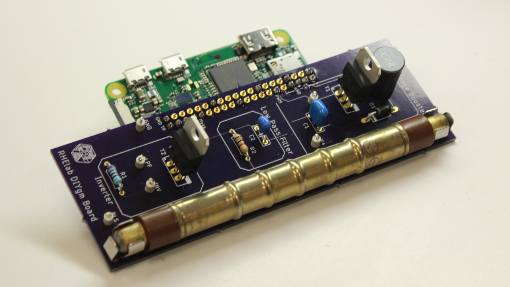

# Do-It-Yourself Geiger-Muller Device
### The Basic Code For A DIYgm Raspberry Pi Device

This is the public access version of the University of Michigan Radiological Health Engineering Laboratory Do-It-Yourself Geiger-Muller Device code.
This code is built to run on a Raspberry Pi Zero W with bluetooth enabled using the UMRHE DIYgm Board and Raspian.

## Tutorials and Wiki

Below is a description of how to set up the raspberry pi with the DIYgm software. Before that is done it may be helpful to build your DIYgm.
There are video tutorials provided [here](video-tutorials.md) that will be helpful to look at. 
We are working on a writtenn Wiki and will hopefully have that soon; however, the video tutorials will always be our first recommendation.

## Usage

Before installing the software make sure you have updated your raspberry pi. To do this open up the terminal (">_" in the toolbar) and type `sudo apt-get update`  

This software requires [python-bluez](https://packages.debian.org/buster/python-bluez) for Buster and pip3 [pybluez](https://github.com/pybluez/pybluez).
You may install these on the Raspberry Pi using:  
`sudo apt-get install python-bluez`  
`sudo pip3 install pybluez`  

Now install the software with:  
`git clone https://github.com/UMRHELab/DIYgm` 

## Running on Raspberry PI  
#### If you plan to use this only on the Raspberry Pi, do this:  

The final step after setting up bluetooth is to type:  
`cp -R DIYgm/rpi-only/* .`

#### **You should be all set at this point**

## Running With A Mobile Application
There exists an optional mobile application for use with the DIYgm software for IOS or Android that links through bluetooth.

Raspberry Pi Softwarefor Bluetooth connection to Mobile Applications

1. First we need to install the pybluez dev library, which will let the Pi connect to the app via Bluetooth. Type:  
`sudo apt-get install libbluetooth-dev` into the Terminal and press Enter. 

2. We now need to edit the newly installed software to make it compatible with the Pi. After installation,  
type: `sudo nano /etc/systemd/system/dbus-org.bluez.service` and hit Enter. You should now be editing a text file.  

3. Use the arrow keys to go to the line `ExecStart=/usr/lib/bluetooth/bluetoothd`. Go to the end of the line and add `--compat` to the end. 
It should now say `ExecStart=/usr/lib/bluetooth/bluetoothd --compat`. Then, press Ctrl+X, Y, and enter. This should end the editing.  

4. We then need to reload some parts of the Pi:  
	a. Type `sudo systemctl daemon-reload`     and press Enter.  
	b. Type `sudo systemctl restart bluetooth` and press Enter.  
	c. Type `sudo chmod 755 /var/run/sdp`      and press Enter. 
 
5. To get to the base directory, where we will install our application files, type: `cd /`  

6. To get the mobile-app files from inside the folder, type in:  
`sudo cp -R /home/pi/DIYgm/mobile-app/* .` (including the period)  

7. We need to install node.js, which will let the Pi connect to the mobile apps via Bluetooth. To do this, type:  
`sudo tar -xf node-v4.3.1-linux-armv6l.tar.gz` (Tip: press Tab to autocomplete the filename)  

8. Type `sudo service bluetooth stop` to turn off the Pi’s Bluetooth for now.  

9. Node.js has already been downloaded as one of the DIYgm files, so we now just have to move it to a system folder. 
Type `cd node-v4.3.1-linux-armv6l` and press Enter. 

10. Type `sudo cp -R * /usr/local` and press Enter.  

11. Restart the Pi’s Bluetooth by typing `sudo service bluetooth start` and pressing Enter

12. Type `cd /` to get back to the main directory

13. You may want to change the name of your Raspberry Pi so you can recognize it in the mobile app. 
To do this, type:  
`sudo nano name.txt` Replace “Raspberry-Pi-DIYgm” with your preferred name for the Pi.

14. We now need to tell the Raspberry Pi how to run the app, to do this we will type:  
	a. `sudo chmod +x startup.sh`  
	b. `sudo chmod +x discoverable.sh`  

15. Now we are all set to run the app with the Raspberry Pi!

16. After downloading the application to your mobile device, all that is left to do is input the command:  
`sudo ./startup.sh`   

When you are finished with the application, you can either remove power from your raspberry pi, or hit ctrl + C on your keyboard to stop the software.

### IOS:
For IOS you must install the test flight application **prior** to downloading the DIYgm app. 
You can do this by either searching for the _Test Flight_ application in the app store, or clicking the link below on your mobile device.  

[**TestFlight**](https://apps.apple.com/us/app/testflight/id899247664)  

Once you have Test Flight downloaded, go to the [**DIYgm on IOS Download Page**](https://testflight.apple.com/join/hFALODXI).  

### Android:  
For android you must download and install the DIYgm APK.  

Download the [**apk file**](https://drive.google.com/open?id=1AitTESAhU4iAu_M2vcSNQPzfiBf2Sed7) on your mobile device. 
 
Run the apk file on your Android phone to install the app

### Running The DIYgm App on Startup  
If you want the DIYgm app to run on your Raspberry Pi when you power it on instead of starting it manually, you should set up a cron job.

Crontab is a software built in to raspberry pi that will run commands on any sort of schedule.
We will add a cron job to start the DIYgm software any time the Raspberry Pi reboots.

1. to get to Crontab type:
	`sudo crontab -e`

2. crontab should ask you which text editor you want to use, you want to choose "nano"   
(Tip: Crontab will also draw an arrow to it telling you it's the easiest).

3. you should be in a text editor now, you'll want to use your arrow keys to scroll down to the first empty line past the _#_'s   

4. When in the empty line type: `@reboot /./auto-launch.sh`  

5. You can now close nano by hitting ctrl+X, Y, and enter, one after another.  

6. The last thing to do is to type `sudo chmod +x auto-launch.sh`  

Your Raspberry Pi is now setup to run the DIYgm software the moment it starts up!  