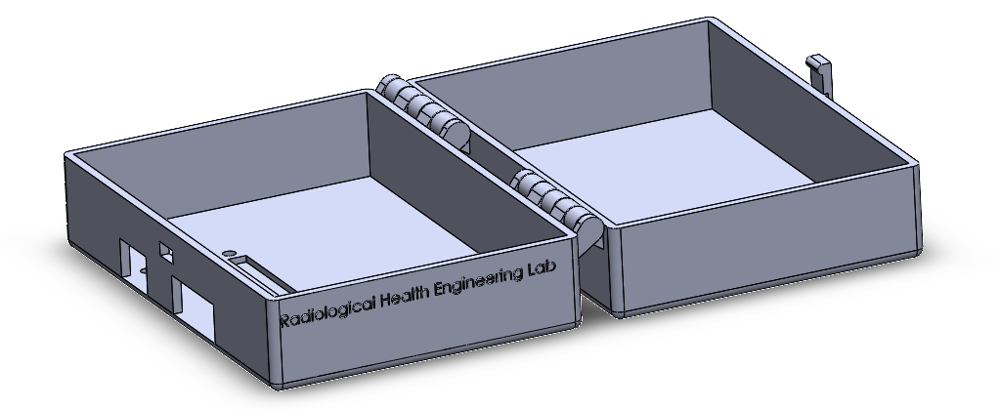
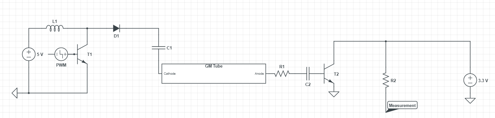
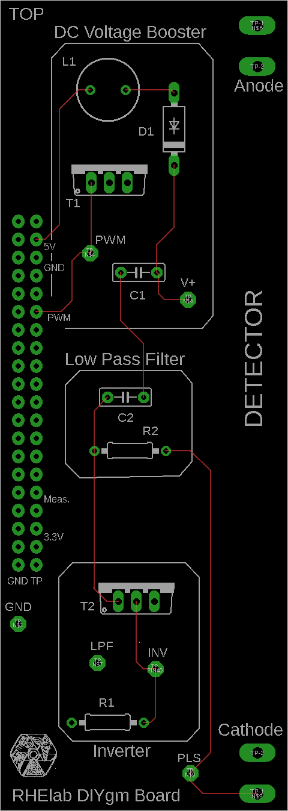
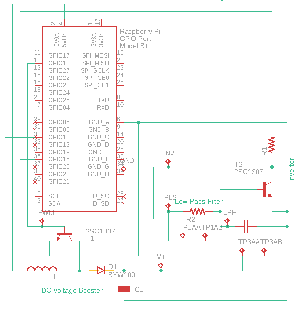

# Video Tutorials

Here are some video tutorials that have been made on how to run and set up your DIYgm. We are always trying to keep these up to date so let us know if something doesn't look quite right.

## Soldering your DIYgm

## Making your custom DIYgm Case

## How the DIYgm Works

## Some Extra Pictures

[]
[]